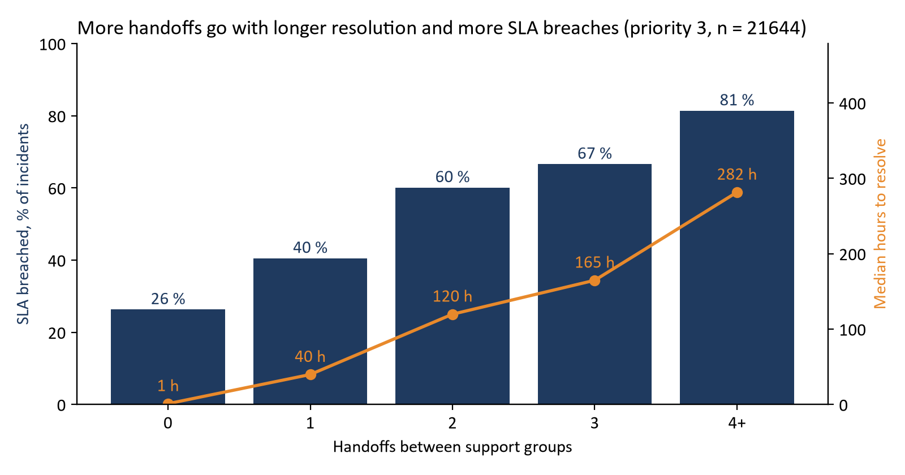
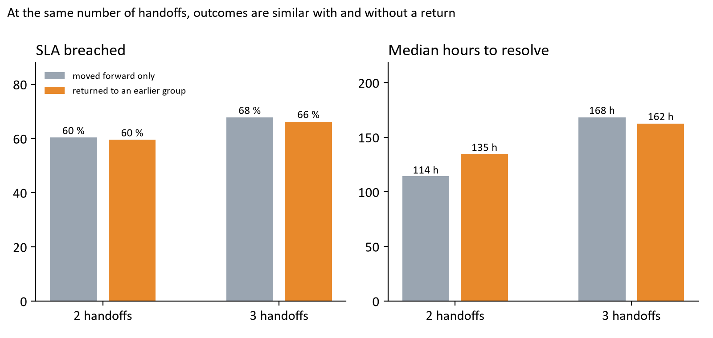
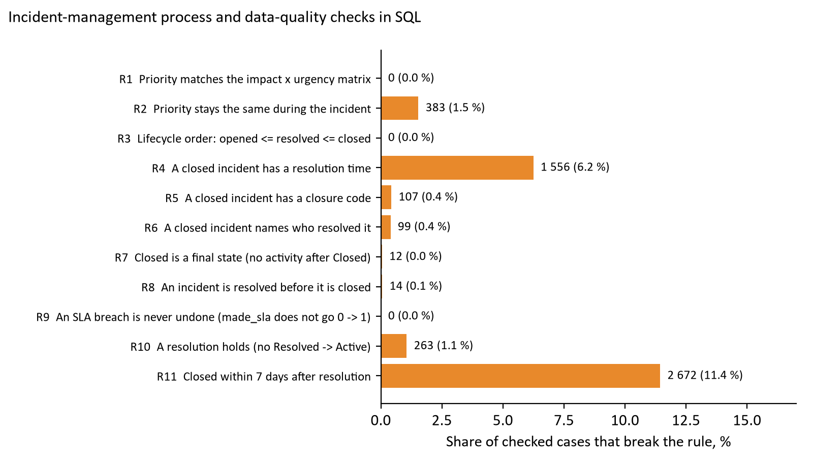

# Handoffs, SLA and process rules in an IT incident log

**Artemiy Zubov, October 2026.** Personal project. SQL (SQLite) on a public event log; charts in Python.

## 1. Question

A service desk passes incidents between support groups when the first group cannot solve them. Two questions:

1. How are handoffs related to resolution time and SLA breaches?
2. Is "ping-pong" (an incident coming back to a group it already visited) worse than a handoff to a new group?

Alongside, eleven incident-management process and data-quality checks are written in SQL: the kind of checks an application administrator or a service desk analyst runs to keep a ticketing tool trustworthy. Some follow common ITIL concepts (the priority matrix, resolve before close), others are specific to this log.

## 2. Data

*Incident management process enriched event log*, UCI Machine Learning Repository no. 498 (Amaral, Fantinato and Peres; DOI 10.24432/C57S4H; licence CC BY 4.0). An anonymised export from a ServiceNow instance of an IT company:

- 141 712 events for 24 918 incidents, opened between February 2016 and February 2017;
- 36 attributes per event: state, priority, impact, urgency, assignment group, reassignment count, SLA flag, timestamps and others.

Five events with the state "-100" were dropped. Values such as priority or closed_at are repeated on every event, so each incident takes them from its last event. 373 incidents (1.5 %) never have an assignment group; their path is unknown, so they are left out of the handoff and ping-pong analysis.

## 3. Method

All logic is in SQL files (`sql/`), run in order by `run_all.py`:

| Step | What it does |
|---|---|
| `load.py` | reads the raw CSV and types it: dates to ISO, "?" to NULL, numbers to integers |
| `01_incidents.sql` | orders events, builds one row per incident, and each incident's path through support groups |
| `02_rules.sql` | eleven process and data-quality checks, each returning cases checked and cases breaking the rule |
| `03_analysis.sql` | handoff and ping-pong comparisons, group profile, priority overview |
| `04_kpi.sql` | reusable service desk KPI pack and category ranking |
| `verify.py` | independent recount of the headline numbers from the raw CSV, without SQL |

**Definitions.**
- *Handoff*: a change of assignment group between consecutive events. Repeated events in the same group count once.
- *Ping-pong*: a handoff back to a group the incident had already visited (A to B to A).
- *SLA breach*: `made_sla = 0`. The meaning of the flag was checked, not assumed: across all 9 114 changes of the flag it only ever goes from 1 to 0, never back (rule R9), and incidents with `made_sla = 1` took 17 hours on average against 438 hours for the rest. This supports reading 1 as "SLA still met".

**Fair comparisons.** The handoff analysis uses priority 3 only (94 % of incidents), so that priority does not mix into the result, and only incidents with a recorded support group. Times are medians, because a few incidents stay open for months. The ping-pong comparison is made at the same number of handoffs: an incident with two handoffs that went A to B to A is compared with one that went A to B to C.

## 4. Results

### 4.1 More handoffs go with longer resolution and more SLA breaches



| Handoffs | Incidents | Median hours to resolve | SLA breached |
|---|---|---|---|
| 0 | 12 737 | 1.1 | 26.3 % |
| 1 | 4 929 | 39.8 | 40.5 % |
| 2 | 1 885 | 119.8 | 60.1 % |
| 3 | 974 | 164.8 | 66.6 % |
| 4 or more | 1 119 | 281.6 | 81.4 % |

Priority 3 incidents with a recorded resolution time and support group (21 644).

Three out of five incidents are solved by the first group, half of them within about an hour. Incidents with one handoff have a median of almost two days, and the SLA breach rate is higher at every further step, from 26 % to 81 %.

### 4.2 Handoff count is a stronger signal than ping-pong



At first sight ping-pong looks harmful: incidents that bounced breach the SLA more often. But they also have more handoffs (3.8 on average against 2.3). Compared at the same number of handoffs, the differences become small and are not consistent:

| Handoffs | Path | Incidents | Median hours | SLA breached |
|---|---|---|---|---|
| 2 | forward only (A to B to C) | 1 179 | 114.5 | 60.4 % |
| 2 | back to an earlier group (A to B to A) | 706 | 134.8 | 59.6 % |
| 3 | forward only | 285 | 168.0 | 67.7 % |
| 3 | back to an earlier group | 689 | 162.5 | 66.2 % |

SLA breach rates differ by less than two points, and the medians differ in opposite directions. This suggests that getting the incident to the right group sooner matters more than only stopping groups from sending it back.

### 4.3 Where handoffs start

Of the 69 groups that receive incidents first, one (Group 70) takes 12 885 incidents, about half of the log, and passes on 35 % of its priority 3 incidents. Among groups with at least 200 priority 3 incidents, two stand out: Group 20 passes on 89 % and Group 9 passes on 92 % (with 38 % ping-pong and 89 % SLA breaches). Group 64 passes on almost nothing (1.4 %, 12 % breaches). Full table: `results/a_groups.csv`. Group names are anonymised, so the reasons cannot be checked here; in a real service desk this table is where a conversation with the team leads would start.

### 4.4 Process and data-quality checks



| Rule | Checked | Breaks | Comment |
|---|---|---|---|
| R1 Priority matches the impact x urgency matrix | 141 707 events | 0 | the system computes priority itself |
| R2 Priority unchanged during the incident | 24 918 | 383 (1.5 %) | reprioritised incidents |
| R3 Opened <= resolved <= closed | 24 918 | 0 | |
| R4 Closed incident has a resolution time | 24 918 | 1 556 (6.2 %) | the largest data gap |
| R5 Closed incident has a closure code | 24 918 | 107 (0.4 %) | |
| R6 Closed incident names who resolved it | 24 918 | 99 (0.4 %) | |
| R7 Closed is a final state | 24 918 | 12 | reopened from Closed instead of a new ticket |
| R8 Resolved before closed | 24 930 closings | 14 | closed straight from New, Active or Awaiting |
| R9 SLA breach is never undone | 9 114 flag changes | 0 | supports the reading of made_sla |
| R10 Resolution holds (no Resolved to Active) | 24 918 | 263 (1.1 %) | returned to Active after resolution |
| R11 Closed within 7 days of resolution | 23 362 | 2 672 (11.4 %) | most close 5 to 7 days after resolution |

The tool enforces the core logic (R1, R3, R9 are clean), so the gaps are in what people fill in: 6 % of closed incidents carry no resolution time, which also removes them from any resolution-time report.

### 4.5 Priority overview

Priority 1 and 2 incidents breach the SLA in 98 % and 99.5 % of cases, against 35.5 % for priority 3 and 15.9 % for priority 4. There are only 270 and 408 such incidents and the SLA targets are not in the data, so I would not read these rates as a measure of team performance; they would be one of the first things to clarify with the service owner.

### 4.6 A KPI pack a service desk can reuse

`sql/04_kpi.sql` turns the analysis into monthly figures a team lead would watch, one row per KPI, so the same query can feed a dashboard:

| KPI | Value |
|---|---|
| Resolved by the first group | 61.0 % |
| Average handoffs per incident | 0.78 |
| SLA breached | 36.6 % |
| Reopened after resolution | 1.1 % |
| Closed without resolution time | 6.2 % |
| Incidents without a support group | 1.5 % |
| Knowledge base used | 14.3 % |

The same file ranks categories by how often they are passed on (priority 3, categories with 300+ incidents). Category 23 is passed on in 83 % of cases and Categories 34, 40 and 57 in 64 to 69 %, while Category 35 stays with the first group in almost nine cases out of ten. These are the categories to review first when routing rules are discussed (`results/a_categories.csv`). The log cannot tell which group should have received them: the last group on an incident is often the first-line group that closes it, so the data supports where to look, not a ready routing rule.

## 5. Limits

- One anonymised company, 2016 to 2017. Group, category and person names are codes, and SLA targets are not in the data.
- The results are associations, not proof of cause: a hard incident both needs more groups and takes longer. The gradient across handoffs is still steep enough to matter in practice.
- `reassignment_count` in the log counts changes of group or of the individual analyst. My handoff count sees only group changes in the audit trail; the two agree for 86 % of incidents with a recorded group (`results/a_reassign_check.csv`).
- This log has been used before, mainly for predicting completion time and for process mining. This project does not claim a new method. Its aim is a practical, reproducible set of checks and a fair comparison of handoff paths.

## 6. What a service desk could do with this

1. Watch first-group resolution as a key figure: it goes with the shortest resolution times by far.
2. Review routing rules for the groups that pass on most incidents (Group 9, Group 20), starting with their most common categories.
3. Make the resolution time and the support group mandatory at closure (R4 and the KPI pack) so that reports cover all incidents.
4. Clarify the SLA targets for priority 1 and 2.

## 7. Reproduce

```
python load.py
python run_all.py
python verify.py
```

Requirements: Python 3 with matplotlib; SQLite 3.25 or newer (window functions). Data: `data/incident_event_log.csv` from the UCI repository; `load.py` creates `incidents.db` from it.
